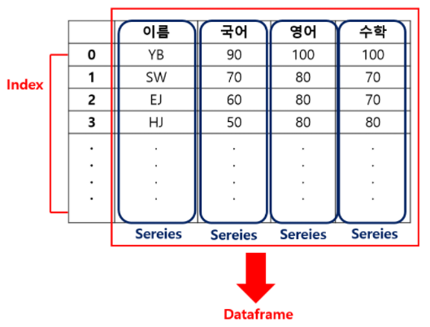

## pandas 

- 대표적인 데이터 분석 패키지 중 하나
- Series, DataFrame등의 자료구조를 활용한 데이터분석 기능을 제공해주는 라이브러리
- Numpy의 array 기능을 보강해서 제작한 것이  pandas
- 라이브러리 구성
  - 여러종류의 클래스와 다양한 함수로 구성
  - Series와 DataFrame의 자료 구조 제공
    - Series : 1차원 배열
    - DataFrame : 2차원 배열

~~~python
#pandas 패키지(모듈) import
#대부분의 코드에서 pandas pd 라는 별칭으로 사용
import pandas as pd
# numpy 패키지 import 판다를 같이 많이 사용함
import numpy as np
~~~

~~~python
## 쥬피터 사용시 많이 사용하는 기능
from IPython.core.interactiveshell import InteractiveShell
InteractiveShell.ast_node_interactivity="all"
~~~

---

## pandas 특징

- 서로 다른 유형의 데이터를 공통된 포맷으로 정리할 수 있음 (클래스 형태로 구성되어 있음)
- 행과 열로 이루어진 2차원 데이터프레임을 처리 할 수 있는 함수 제공
- 2차원 형태로 구성된 데이타를 효율적으로 처리할 수 있음

---

## pandas 주요 자료구조

- Series : 행렬에서는  하나의 열(Column)이 Series에 해당되고, 1차원 배열에 해당됨
- DataFrame : 행과 열로 구성된 행렬이 DataFrame이고, 2차원 배열에 해당됨

---

