## Series

- pandas에서 제공하는 자료구조 중 하나
- 1차원 배열 형태로 index와  value가 1대1 대응하는 구조
  - 딕셔너리와 비슷한 구조 {key(index):value}
  - index는 사용자가 필요에 따라 변경 가능
- 동일한 data type만 가질 수 있음
  - ex) 문자열이 섞여 있으면 모두 문자열 처리 / int와 float 섞여 있으면 float 처리

---

## Series 생성

- index는 명시하지 않으면 0 부터 자동 생성
- 2개 이상의 값 입력시 리스트/튜플/딕셔너리 형태로 입력

----

## range로 Series 생성

---

## 결측값을 포함한 Series 생성

- 결측값 : 값이 정해지지 않은 상태로 NULL의 의미
  - 결측값이 NaN은 numpy의 na.nan으로 생성 가능

---

## Series index

- Series index는 데이터에 대한 열 속성값을 의미
- 숫자 인덱스 지정.문자 인덱스 지정
- 변수 = pd.Series([값1, 값2, ....], index = [인덱스1, 인덱스2, ...])

---

## index name 설정

- Series index의 name 설정 가능

---

## Series 값 추출

- 정수형 위치 인덱스(integer position) 가능
- 인덱스 이름(index name) or 인덱스 라벨(index label) 가능
- 리스트 및 슬라이싱 기능으로 가능
- dot + 이름 가능 (단, index name 문자 일 경우)

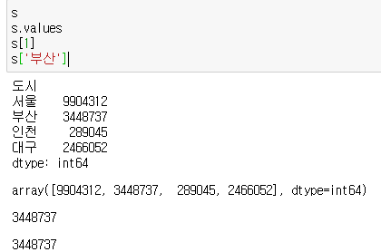

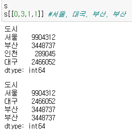

---

## 인덱스 재사용

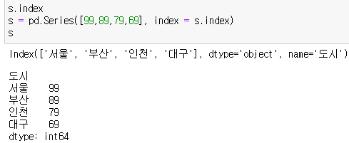

---

## Series 연산

- Series는 연산할 때 벡터화 연산을 진행
  - 벡터화 연산 : 집합적 자료형의 원소 각각을 독립적으로 계산하는 방법
  - 연산은 시리즈 값에만 적용되고 인덱스는 값은 변경되지 않음

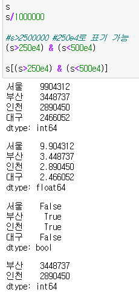

---

## Series 간의 연산

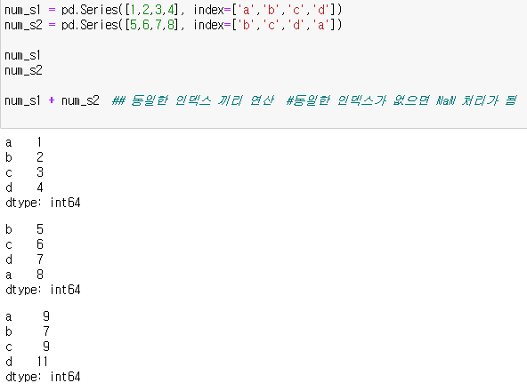

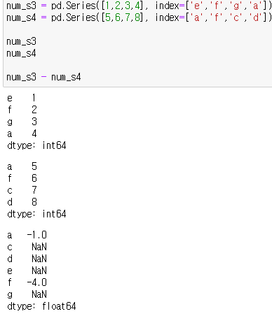

---

## **Boolean selection**

- boolean Series가 [ ]와 함께 사용되면 True 값에 해당하는 값만 새로 반환되는 Series객체에 포함됨
- 다중조건의 경우, &(and), |(or)를 사용하여 연결 가능

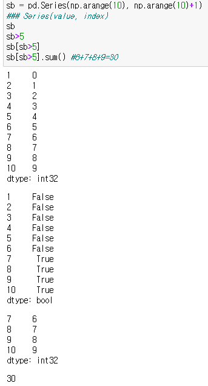

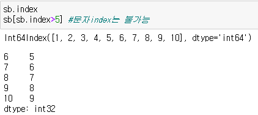

---

## in/for 연산자 사용

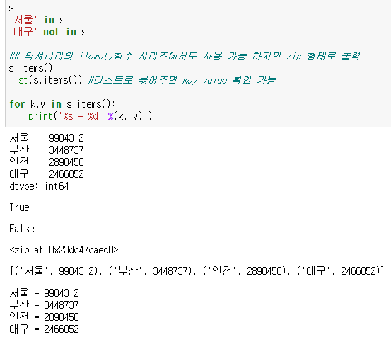

---

## Series 데이터 수정/추가/삭제

- 딕셔너리와 동일한 방식

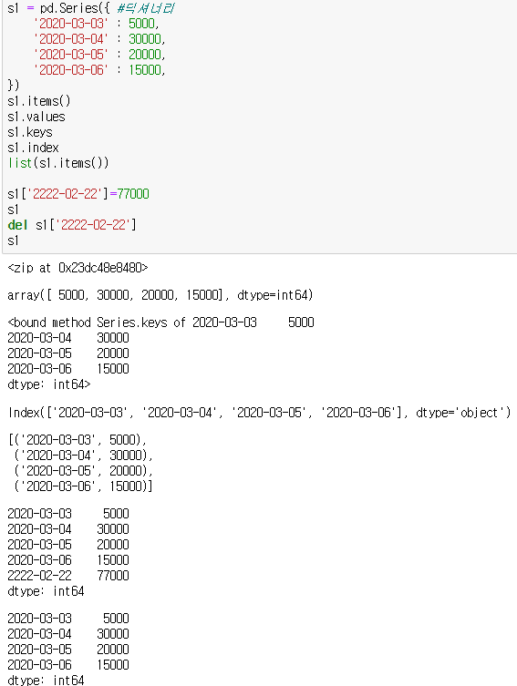

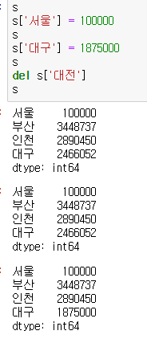

---

## 주요 함수 정리

- size : 개수 반환
- shape : 해당값 이 어떤 행렬로 구성되었는 반환
- unique: 유일한 값만 ndarray로 반환
- count : NaN을 제외한 개수를 반환
- mean: NaN을 제외한 평균
- value_counts: NaN을 제외하고 각 값들의 빈도를 반환

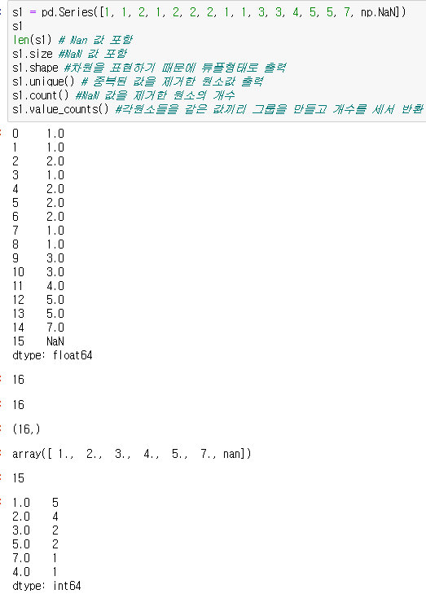

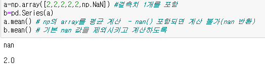