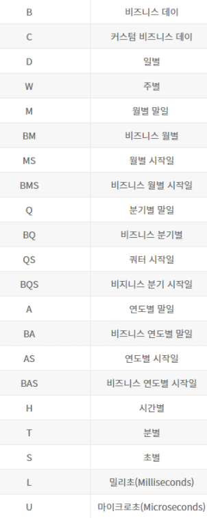
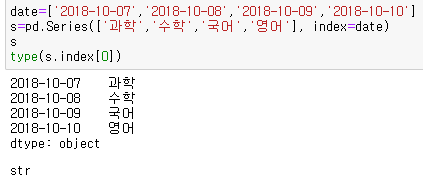

## date_range

- Serise의 index에 날짜 데이터를 적용할 수 있음
- d.date_range(start=None, end=None, periods=None, freq='D')
- start : 시작날짜/ end= 끝날짜 / periods = 날짜 생성기간/ frep = 날짜 생성 주기
- start는 필수 옵션/end나 periods는 둘 중 하나가 있어야 함/ freq는 기본 Day로 설정

---

## date range 사용

