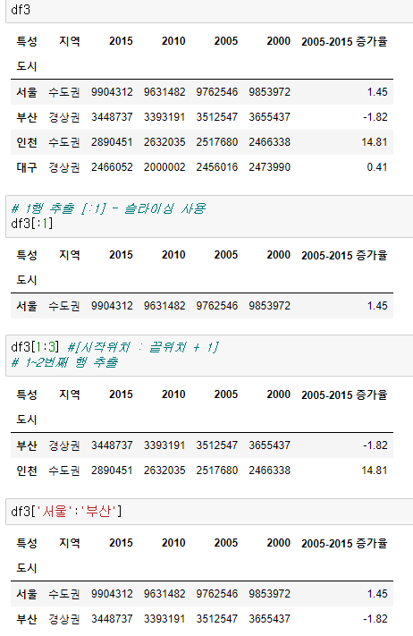

## DataFrame

- 행과 열로 구성되어진 2차원 배열의 자료구조 (spreadsheet와 동일한 개념)
- DataFrame의 열은 Series로 구성되어 있음
  - 여러 개의 Series가 모여 있는 집합
- DataFrame 때문에 pandas를 사용

---

## DataFrame 생성

- 리스트 하나로 입력하면 data가 각각의 행으로 입력됨 (열로 들어감)
- 리스트 리스트로 묶어서 입력하면 동일한 행으로 입력됨 (행으로 들어감)
- pd.DataFrame([입력값], [인덱스], [컬럼])

---

## 딕셔너리로 DataFrame 생성

- dict의 key -> column name 생성
- dict item은 데이터프레임의 column으로 정의

---

## Series로 DataFrame 생성

- pd.DataFrame(시리즈) : 시리즈를 열로 정의 - 1개의 시리즈가 전달
- 여러 개의 시리즈를 이용해서 데이터 프레임 생성 : 리스트로 묶어서 전달
  - pd.DataFrame([시리즈1, 시리즈2, ...]) : 리스트 원소 시리즈 1개가 한 행으로 정의
    - Series를 리스트 형식으로 묶어서 생성할 경우 Serises가 행 단위로 입력됨
  - 시리즈의 인덱스 => 컬럼 명으로 생성

---

## 외부 데이터 DataFrame 생성

- 데이터 분석을 위해, dataframe을 생성하는 가장 일반적인 방법
- pandas.read_csv 함수 사용해서  csv(comma separated values) 파일로부터 DataFrame 생성

---

## read_csv 함수 파라미터
 - sep : 각 데이터 값을 구별하기 위한 구분자(separator) 설정 
    - default 값 ,
 - header : header를 무시할 경우, None 설정
 - index_col : index로 사용할 column 설정
    - usecols를 사용할 경우 usecols 존재하는 항목만 사용 가능
 - usecols : 실제로 dataframe에 로딩할 columns만 설정

---

## 인덱스와 컬럼의 이해

- 인덱스(index)
  - index 속성
  - 각 아이템을 특정할 수 있는 고유의 값을 저장
  - 복잡한 데이터의 경우, 멀티 인덱스로 표현 가능

- 컬럼(column)
  - columns 속성
  - 각각의 특성(feature)을 나타냄
  - 복잡한 데이터의 경우, 멀티 컬럼으로 표현 가능

---

## DataFrame 데이터 파악하기

- shape 속성 (row, column)
- describe 함수 - 숫자형 데이터의 통계치 계산
- info 함수 - 데이터 타입, 각 아이템의 개수 등 출력

---

## DataFrame 전치

- 판다스 데이터프레임은 전치를 포함해서 Numpy 2차원 배열에서 사용할 수 있는 속성이나 메서드를 대부분 지원
- 전치 : 행과 열을 바꿈
  - 관련속성 : df.T
  - 전치를 해도 DataFrame 속성유지 및 원본 데이터는 변환되지 않

---

## DataFrame 수정 /추가/삭제
- 해당 열이 있으면 수정, 없으면 추가
- 열추가 : df[열이름(key)]=values
- 열 내용 갱신 : df[열이름(key)]=values

---

## DataFrame 인덱싱

- 열 인덱싱

- 행 인덱싱 (인덱서를 사용하지않는) 
- [ ]기호를 이용해서 인덱싱할때 주의점 : [ ]기호는 열 위주 인덱싱이 원칙
  - 이러한 문제를 해결하기 위해 loc/iloc 사용

---

## DataFrame 열 인덱싱

---

## DataFrame 행 인덱싱

## 행 단위 인덱싱

- 행단위 인덱싱을 하고자 하면 인덱서(loc/iloc)라는 특수 기능을 사용하지 않는 경우 슬라이싱을 해야 함
- 인덱스 값이 문자(라벨)면 문자슬라이싱도 가능

---

## DataFrame 개별 요소 접근

- DataFrame은 [열] [행] 순으로 개별 요소에 접근
- loc/ioc를 사용하면 [행] [열] 순으로 접근 가능

---

## DataFrame 인덱서 (loc / iloc)

- Pandas는 numpy행렬과 같이 쉼표를 사용한 (행 인덱스, 열 인덱스) 형식의 2차원 인덱싱을 지원
    - 특별한 인덱서(indexer) 속성을 제공
* loc : 라벨값 기반의 2차원 인덱싱
* iloc : 순서를 나타내는 정수 기반의 2차원 인덱싱

- 기존 방식
  - df['열']

  - df[:'행'] 슬라이싱이 반드시 필요

  - df['열'] [:'행]

    

- pandas 패키지는 [행번호] [열번호] 인덱싱 불가
    - iloc 속성 사용하면 가능
    - iloc[행번호,열번호] - 가능
    - loc[행제목,열제목] -가능

---

## loc 사용 예

- df.loc[행_인덱스_값] :행 우선 인덱싱
- df.loc[행_인덱스_값, 열_인덱스_값]

---

## iloc 사용 예

- 라벨(name)이 아닌 위치를 나타내는 정수 인덱스만 받는다.
- 위치 정수값은 0부터 시작
- 데이터프레임.iloc[행,열]

