## count() 함수

- 가장 간단한 분석은 개수를 세는 것임
- NaN 값은 세지 않음 (유효한 값만 처리한다는 의미)

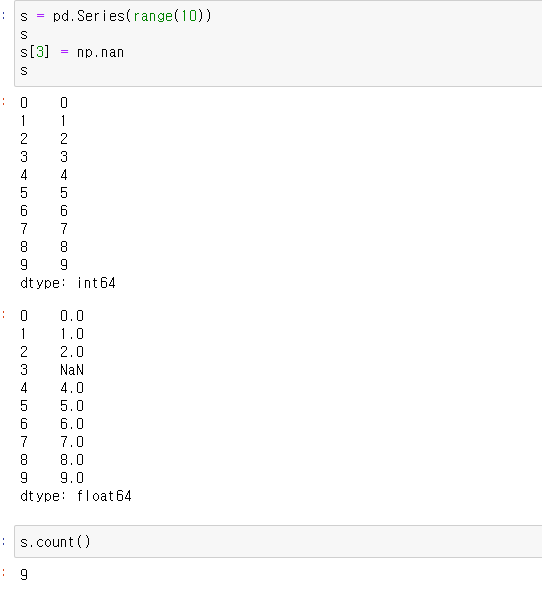


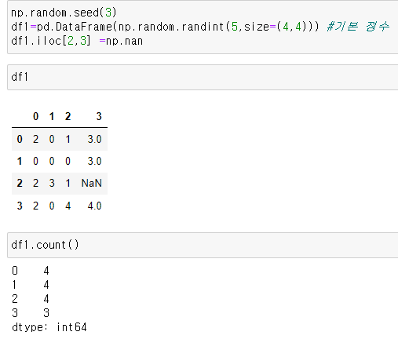

---


## import 한 값 유효성 확인

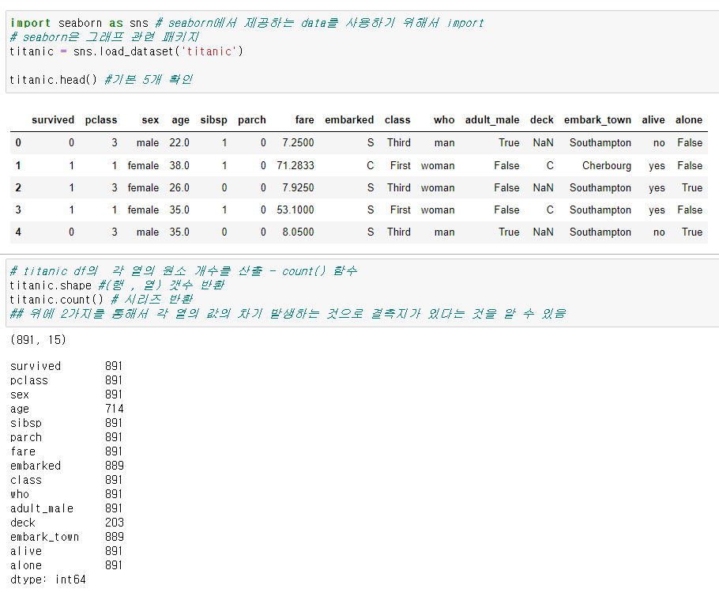

---


## value_counts() - 카테고리 값 세기

- 시리즈의 값이 정수,문자열 등 카테고리 값인 경우에
- 시리즈.value_counts() 메서드를 사용해 각각의 값이 나온 횟수를 셀 수 있음
- 파라미터 normalize=True 를 사용하면 각 값 및 범주형 데이터의 비율을 계산
  - 시리즈.value_counts(normalize=True)

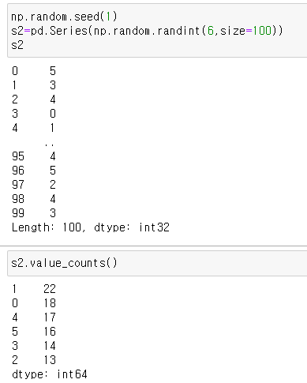

---


## value_counts() 함수 - 범주형 데이터에 적용

- 범주형 데이터 : 관측 별과가 몇개의 범위 또는 항목의 형태로 나타나는 자료
  - ex. 성별(남,여), 선호도(좋다, 보통, 싫다), 혈액형(A,B,O,AB) 등

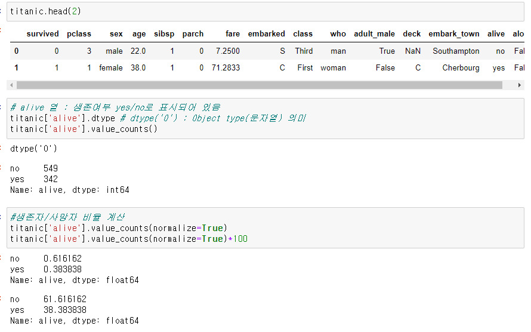

----


## value_counts() 함수- 데이터 프레임 사용

- 행을 하나의 value로 정의 동일한 행이 몇 번 나타났는지를 반환
- 행 데이터의 경우가 인덱스 설정 개수된 값이 value로 표시되는 Series 반환

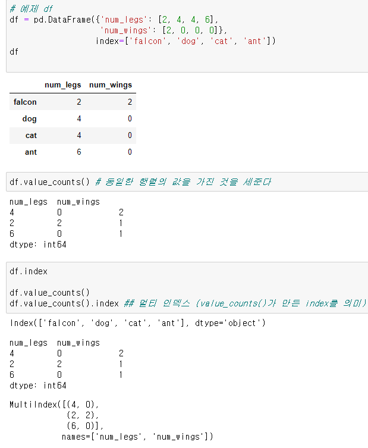


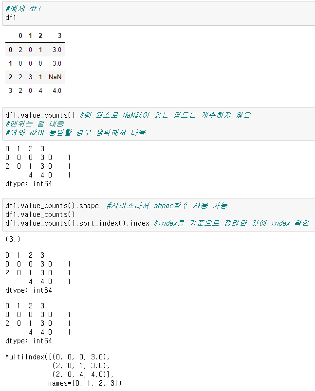

---


## 데이터 정렬 - 정렬 함수 사용

- 데이터 정렬은 Series와 DataFrame 둘다 사용 가능

- sort_index() : 인덱스를 기준으로 정렬
- sort_value() : 데이터 값을 기준으로 정렬
  - DataFrame에서 사용 시 기준 열이 필요함

---


## Series 정렬 ascending=True/False

- sort_index() / sort_value() 조합해서 사용
- ascending=True/False : 오름차순/내림차순
- 생략하면 오름차순


- 인덱스 기준

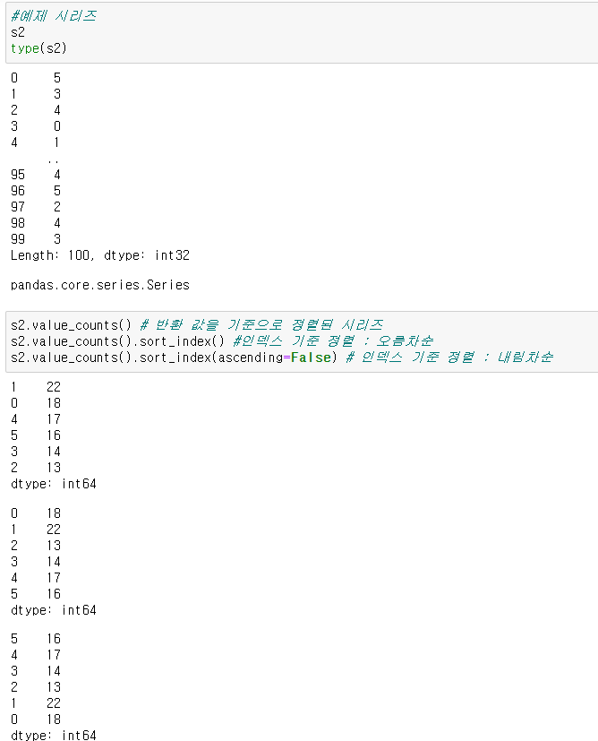


- value 기준

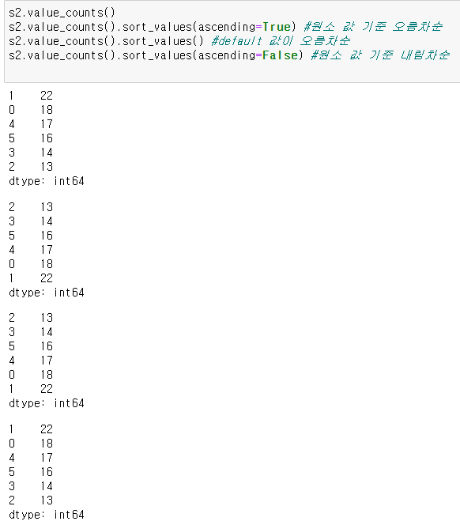

---


## DataFrame 정렬

- df.sort_values() : 특정열 값 기준 정렬
    - DataFrame은 2차원 배열과 동일하기 때문에
        - 정렬시 기준열이 필요함  (by 인수 사용 : 생략 불가)
        - by = 기준열, by=[기준열1,기준열2]
    - 오름차순/내림차순 : ascending = True/False (생략하면 오름차순)
- df.sort_index() : DataFrame의 index 기준 정렬
    - 오름차순/내림차순 : ascending = True/False (생략하면 오름차순)


- value 값 기준

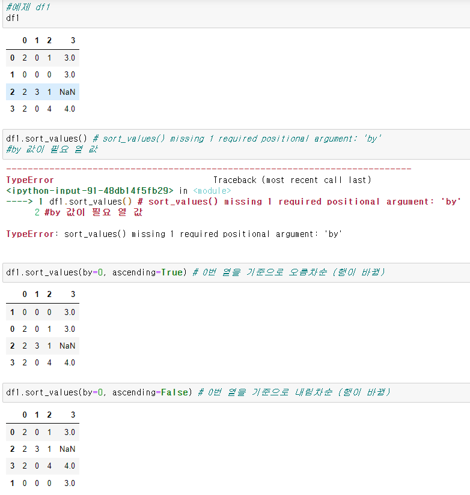


- index 기준

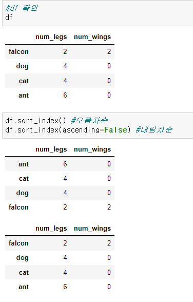

---


## DataFrame 조작 함수

- 행/열 합계, 평균, 최대, 최소 등이 존재

- 사용 시 주의할 점

  - 행과 열의 합계를 구할때는 sum(axis=0/1) - axis는 0이 기본

  - 각 열의 합계를 구할때는 sum(axis=0)
  - 각 행의 합계를 구할때는 sum(axis=1)

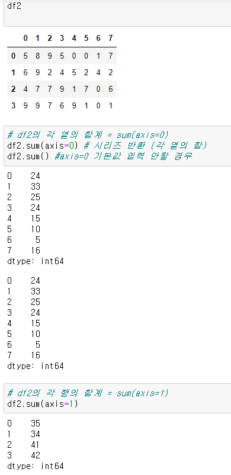


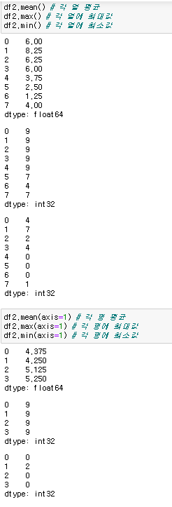

---


## DataFrame 행과 열 추가

- 열 추가 : 기본 인덱싱
  - df['새로운 열 이름'] = 값
- 행 추가 : loc 인덱서
  - df.loc['새로운 행 익뎃스'] = 값


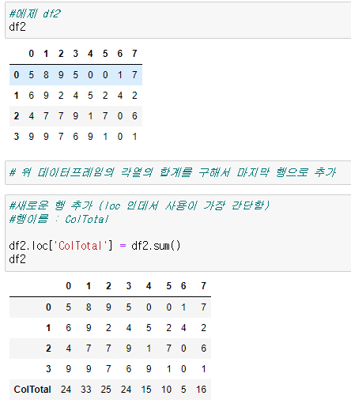


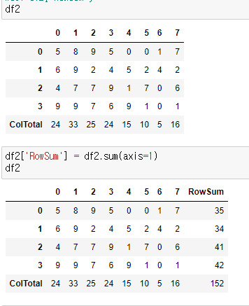

---


## 행/열 삭제 - DataFrame의 drop() 

- df.drop('행이름',0) : 행삭제
  - 행삭제 후 df로 결과를 반환
- df.drop('열이름',1) : 열 삭제
  - 열삭제 후 df로 결과를 반환
- 원본에 반영되지 않으므로 원본수정하려면 저장 해야 함
- del 명령어는 삭제후 원본을 변경시키는 명령어 이점이 가장 큰 차이

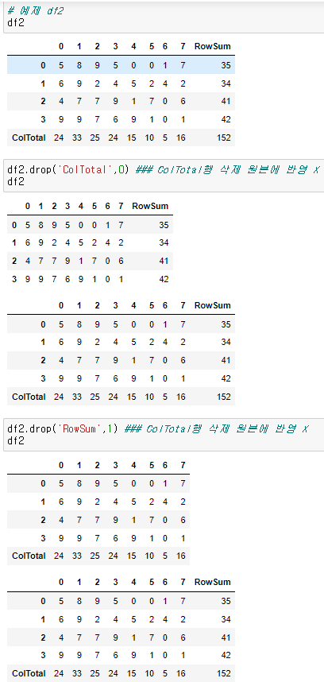

---


## NaN 값 처리 함수

- df.dropna(axis=0/1) - 삭제
  - NaN 값이 있는 열 또는 행을 삭제
  - 원본 반영되지 않음
- df.fillna(채우려는 값) - 입력
  - NaN 값을 정해진 값으로 채움
  - 원본 반영되지 않음

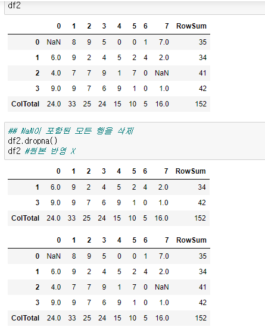

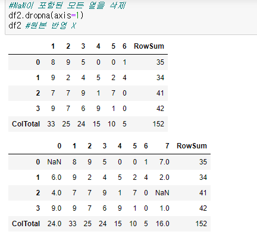

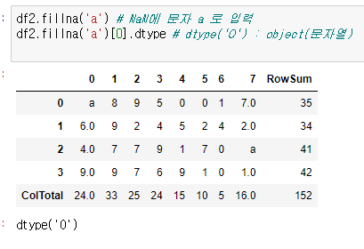

---


## astype() - 형변환

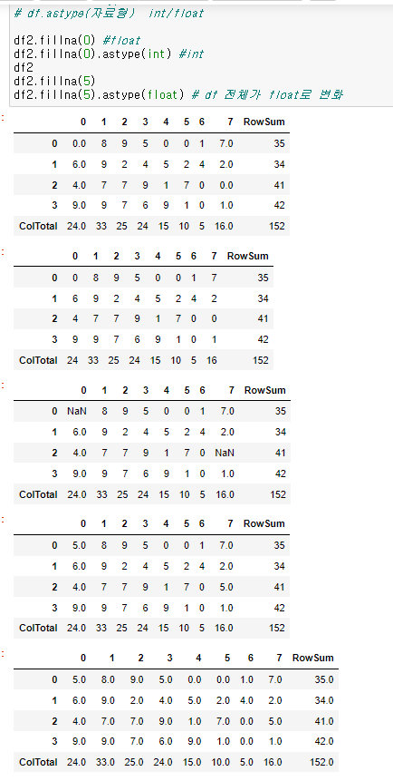

---


## apply() 함수 - 열 또는 행에 동일한 연산 반복 적용

- apply() 함수는 DataFrame의 행이나 열에 복잡한 연산을 벡터화할 수 있게 해주는 함수로 매우 많이 활용되는 함수임
- 동일한 연산을 모든열에 혹은 모든 행에 반복 적용하고자 할때 사용
- apply(반복적용할 함수, axis=0/1)
  - 0 : 열마다 반복
  - 1 : 행마다 반복
  - 생략시 기본값 : 0
- 데이터프레임의 기본 집계함수(sum, min, max, mean 등)들은 행/열 단위 벡터화 연산을 수행함
  - apply() 함수를 사용할 필요가 없음
- 일반적으로 apply() 함수 사용은 복잡한 연산을 해결하기 위한 lambda 함수나 사용자 정의 함수를 각 열 또는 행에 일괄 적용시키기 위해 사용

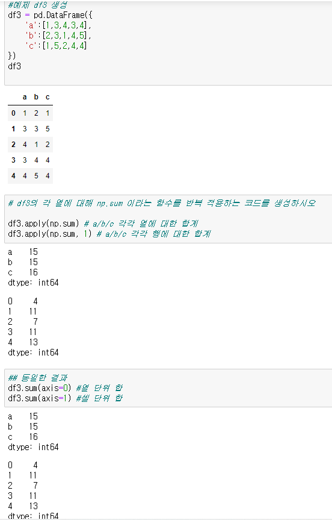

---


## apply() 함수 적용 예시 - lambda 함수에 apply() 사용 예제

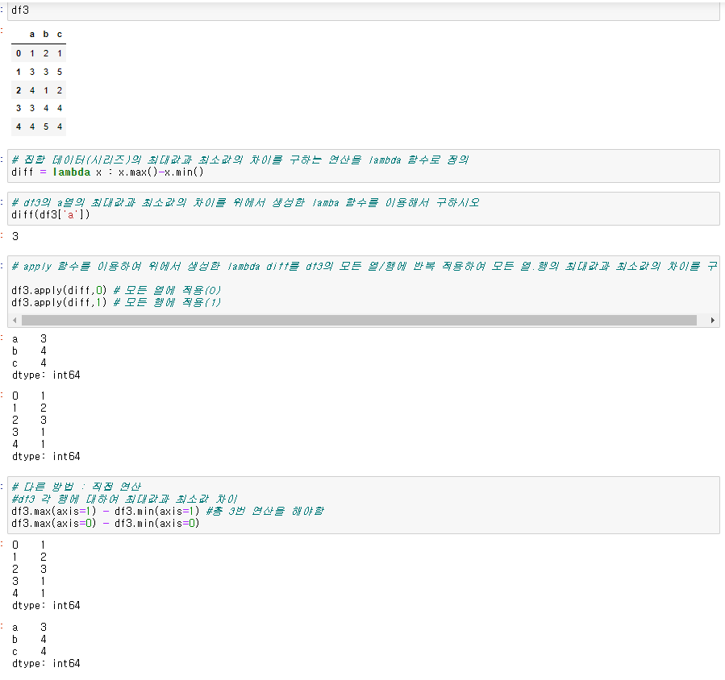

---


## DataFrame에 value_counts로 카테고리 계산

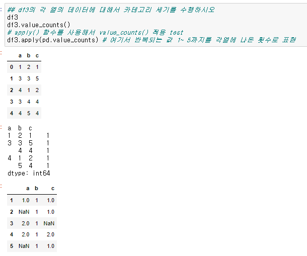

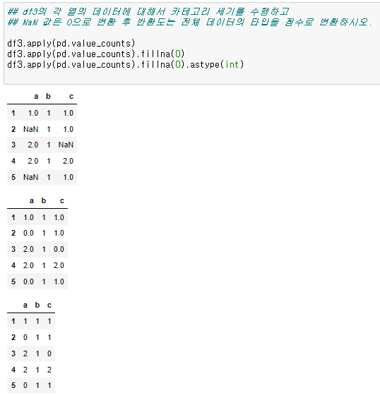

---


## 관측 데이터 값을 범주형(카테고리) 값으로 변환

- 값의 크기를 기준으로 카테고리 값으로 변환하고 싶을 때
  - cut(data, bins, label)
  - data : 구간을 나눌 실제 관측 값, bins : 구간 경계 값, label : 카테고리 값

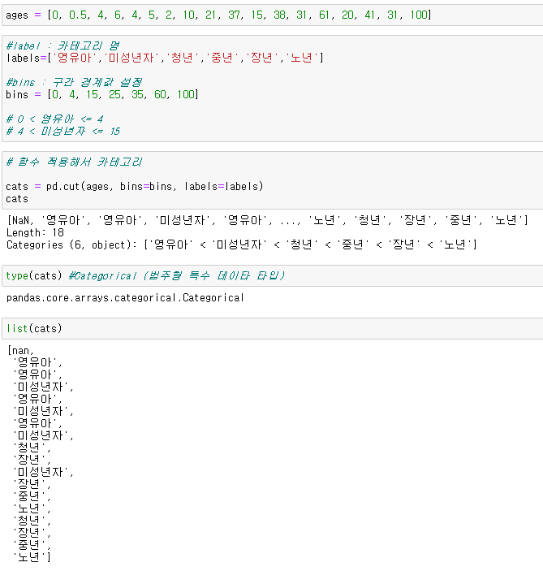

---


## Categorical 클래스 객체

- 카테고리명 속성 : Categorical.categories
- 코드 속성 : Categorical.codes
  - 인코딩한 카테고리 값을 정수로 갖음

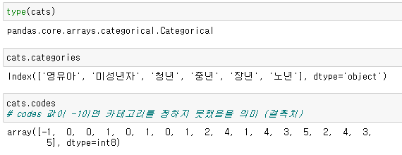

----


## qcut()

- 구간 경계선을 지정하지 않고 데이터 개수가 같도록 지정한 수의 구간으로 분할하는 함수
- 형식 : pd.qcut(data,구간수,labels=[d1,d2....])

```
- 예)1000개의 데이터를 4구간으로 나누려고 한다면
    - qcut 명령어를 사용 한 구간마다 250개씩 나누게 된다.
    - 예외)같은 숫자인 경우에는 같은 구간으로 처리한다.
```

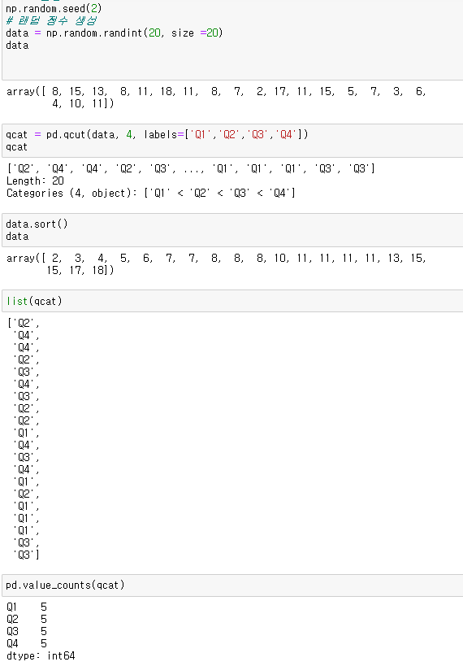

---


## set_index(), reset_index() - 데이터 프레임 인덱스 설정

- set_index() : 기존 행 인덱스를 제거하고 데이터 열 중 하나를 인덱스로 설정해주는 함수
- reset_index() : 기존 행인덱스를 제거하고 기본인덱스로 변경
  - 기본인덱스 : 0부터 1씩 증가하는 정수 인덱스
  - 따로 설정하지 않으면 기존 인덱스는 데이터열로 추가 됨

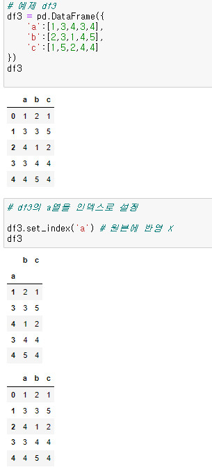


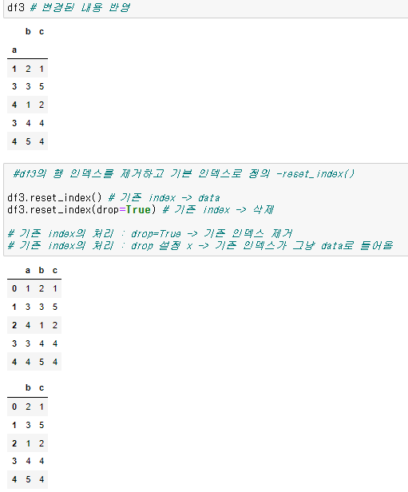

---


##  DataFrame. rename() 

- index 원소 변경하기 

- df.rename(index={현재인덱스:바꿀인덱스})

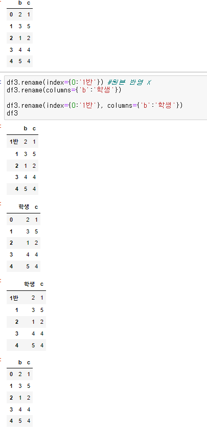