## merge

- 2개 의 DataFrame의 공통 열 이나 인덱스를 기준으로 데이터프레임을 합치는 것
- 기준이되는 열 데이터를 key라고 함

---

## merge 형식

- df.merge(df1) : 두 df를 병합
- 기본은 inner join : 양쪽에 동일하게 존재하는 키만 표시
- key : 기준열을 의미
    -  실제 데이터 필드 or 행 인덱스 
- 병합방식
    - inner join :  양쪽 df에서 모두 키가 존재하는 data만표시
    - left join : 왼쪽 df에 존재하는 키 데이터는 모두 표시, 오른쪽 df는 키가 중복되면 표시
    - right join : 오른쪽 df에 존재하는 키 데이터는 모두 표시, 왼쪽 df는 키가 중복되면 표시
    - outer join :  한쪽에만 키가 존재하면 data를 표시
    - 병합방식을 설정 : how=inner(생략가능), how=outer

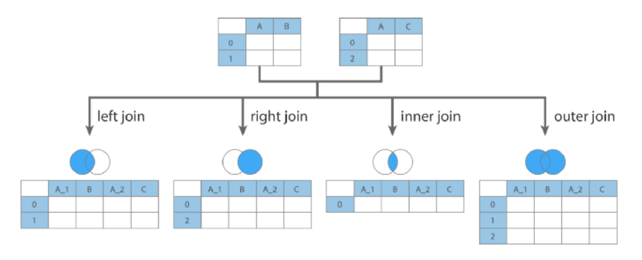

---

## merge - inner join

- 양쪽 df에 모두 키가 존재하는 것 만 병합
- 교집합 개념

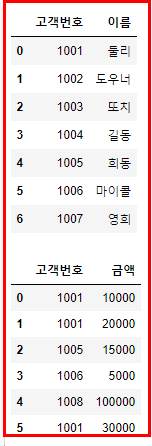

​																	     기준값 (df1/df2)

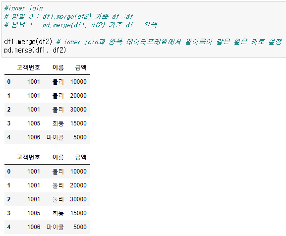

---

## merge - outner join

- pd.merge(df1,df2, how = 'outer')
- 합집합 개념으로 모든 키 값을 표현
- 어느 한 df에 데이터가 존재하지 않으면 NaN으로 표시됨

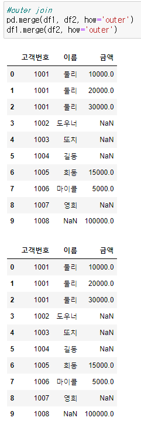

---

## merge - left/right join

- how=left : 왼쪽 df에 있는 모든 키의 데이터는 표시
- how=right : 오른쪽 df 에 있는 모든 키의 데이터는 표시

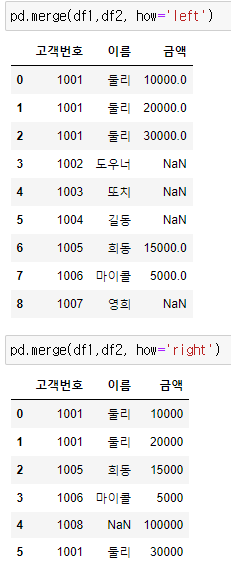

---

## 동일한 키 값이 있는 경우

- 동일한 키 값이 존재할 경우 가능한  모든 경우의 수에 대해 생성해줌

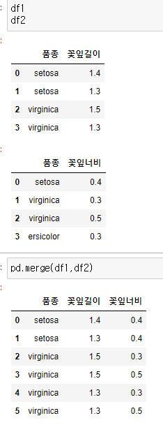

---

##  on 파라미터로 merge

- 동일한 key(column) 존재할 경우 or key(column) 값이 다르게 명시된 경우 에러가 발생
  - key 값이 의미하는 것이 서로 다르기 때문에 에러 발생
  -  기준을 잡을 수 없어서 에러 발생

- 두 데이터 프레임에서 열이름(컬럼명)이 같은 모든 컬럼은 키가 될 수 있음
- 이름이 같아도 키가 되면 안되는 열이 있으면 기준열 명시 : on 파라미터의 인수를 설정

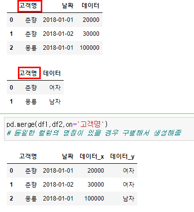

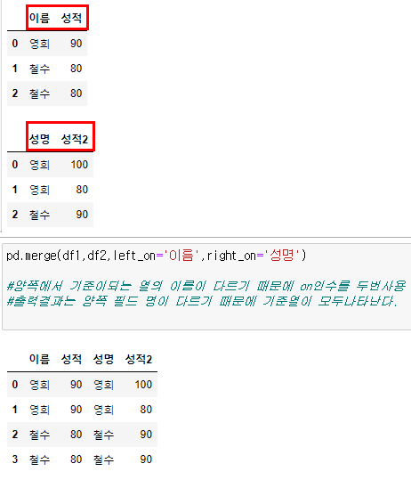

---

## index로 merge

- 열 기준이 아닌 index를 기준으로 merge 가능

- left_index = True / right_index = True 설정을 하게 됨

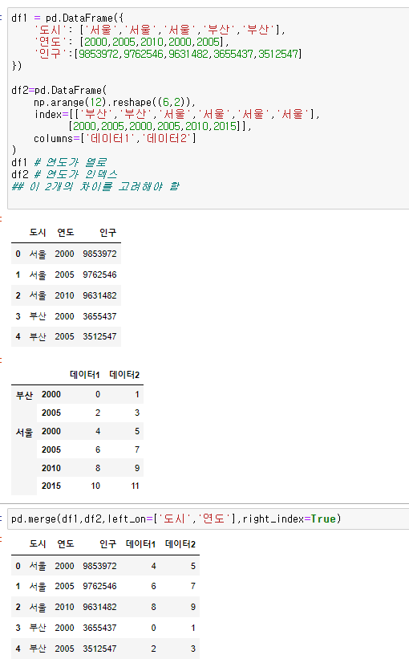

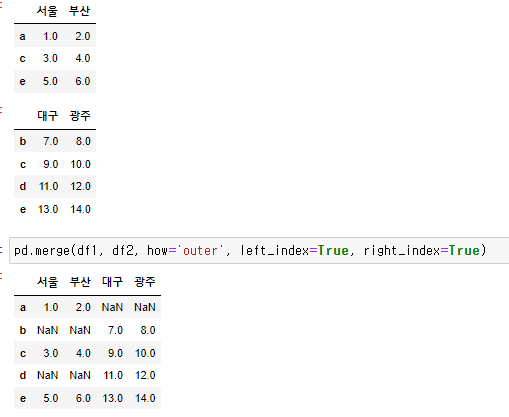

---

## join()

- merge 대신 join을 사용 가능

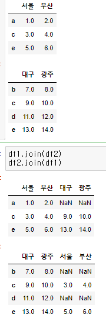

---

