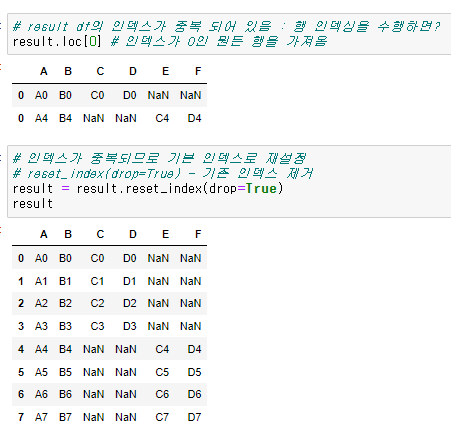

## concat

- concat 명령을 사용하면 기준열 없이 데이터를 연결
- 기본은 위 아래로 데이터 행 결합(row bind) axis 속성을 1로 설정하면 열 결합(column bind)을 수행
- 시리즈나 데이터프레임을 연결할 경우 인덱스 값이 중복될 수 있음

---


## DataFrame 결합

````python
 pd.concat( objs,  #Series, DataFrame, Panel object  
    axis=0,  # 0: 위+아래로 합치기, 1: 왼쪽+오른쪽으로 합치기   
    join='outer', # 'outer': 합집합(union), 'inner': 교집합(intersection)  
    ignore_index=False,  # False: 기존 index 유지, True: 기존 index 무시  
    keys=None, # 계층적 index 사용하려면 keys 튜플 입력)
````





----


## 다중 인덱스 접근


---

## Series 결합


---

