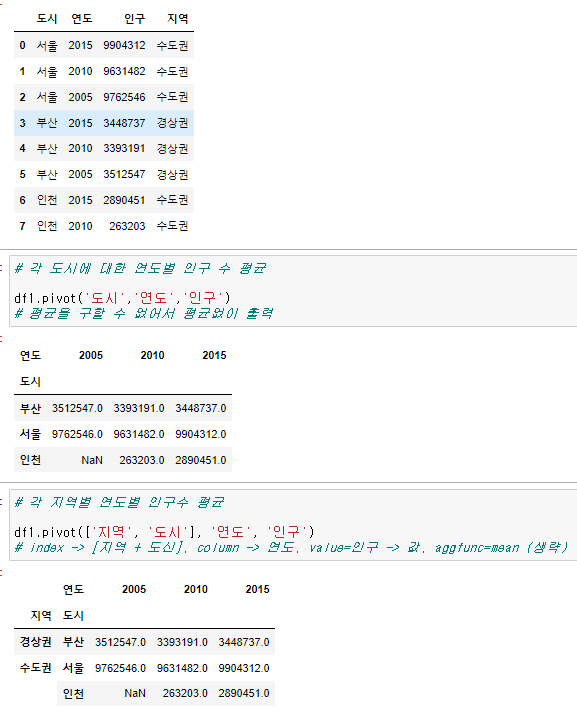
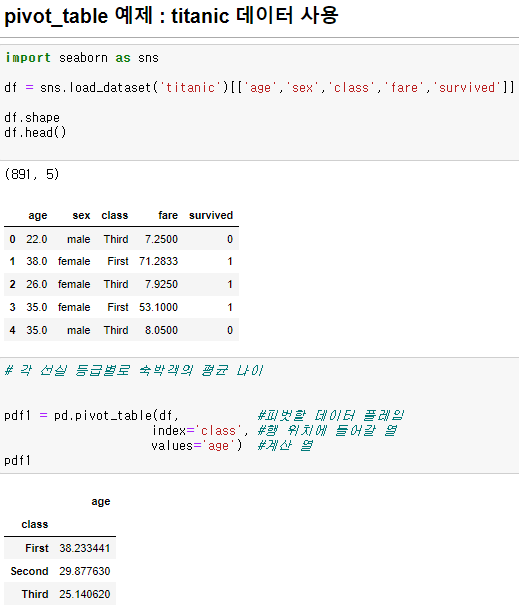
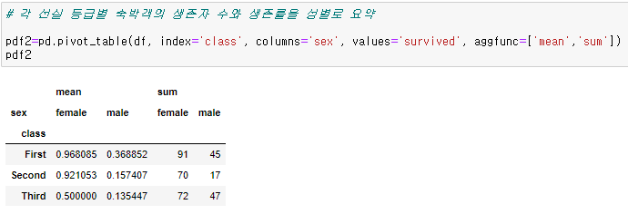

## pivot 

- 가지고 있는 데이터원본을 원하는 형태의 가공된 정보를 보여주는 것
-  자료의 형태를 변경하기 위해 많이 사용하는 방법  

---

## pivot 사용법

- 방법 : 2개의 키를 사용해서 데이터를 선택
  - data, index는 필수 적으로 선택해야 함

- pivot_table(data,values=None,index=None,columns=None,aggfunc='mean',margins=False,margins_name='All')

    - data : 분석할 데이터 프레임. 메서드 형식일때는 필요하지 않음 ex)df1.pivot_table()
    - values : 분석할 데이터 프레임에서 분석할 열
    - index :  행 인덱스로 들어갈 키열 또는 키열의 리스트
    - columns : 열 인덱스로 들어갈 키열 또는 키열의 리스트
    - fill_value : NaN이 표출될 때 대체값 지정
    - margins : 모든 데이터를 분석한 결과를 행으로 표출할 지 여부
    - margins_name : margins가 표출될 때 그 열(행)의 이름`
    - aggfunc : 집계함수 (요약 결과에 적용시킬 함수)

----

