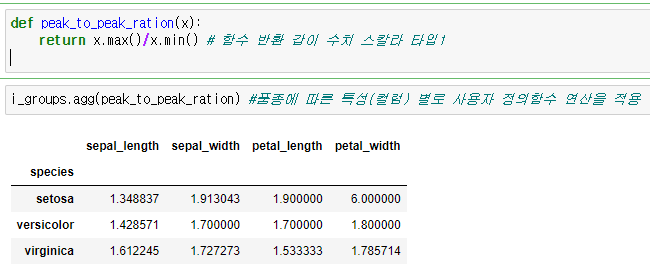

## 그룹 분석

- 만약 키가 지정하는 조건에 맞는 데이터가 하나 이상이라서 데이터 그룹을 이루는 경우에는 그룹의 특성을 보여주는 그룹분석(group analysis)을 해야 함

    - 그룹분석은 피봇테이블과 달리 키에 의해서 결정되는 데이터가 여러개가 있을 경우 미리 지정한 연산을 통해 그 그룹 데이터의 대표값을 계산 하는 것

- pandas에서는 groupby 메서드를 사용하여 아래 내용 처럼 그룹분석을 진행

    - 분석하고자 하는 시리즈나 데이터프레임에 groupby 메서드를 호출하여 그룹화 수행

    - 그룹 객체에 대해 그룹연산을 수행

---

## groupby

- groupby 메서드는 데이터를 그룹 별로 분류하는 역할을 함 

- groupby 메서드의 인수

    - 열 또는 열의 리스트

    - 행 인덱스

- 연산 결과로 그룹 데이터를 나타내는 GroupBy 클래스 객체를 반환
    - 이 객체에는 그룹별로 연산을 할 수 있는 그룹연산 메서드가 있음

---

## groups 클래스 객체의 그룹연산 메서드

- size, count: 그룹 데이터의 갯수

- mean, median, min, max: 그룹 데이터의 평균, 중앙값, 최소, 최대

- sum, prod, std, var, quantile : 그룹 데이터의 합계, 곱, 표준편차, 분산, 사분위수

- first, last: 그룹 데이터 중 가장 첫번째 데이터와 가장 나중 데이터

---

## group 함께 사용하는 함수

- agg, aggregate
  - 만약 원하는 그룹연산이 없는 경우 함수를 만들고 이 함수를 agg에 전달한다.
  - 또는 여러가지 그룹연산을 동시에 하고 싶은 경우 함수 이름 문자열의 리스트를 전달한다.
- describe
  - 하나의 그룹 대표값이 아니라 여러개의 값을 데이터프레임으로 구한다.
- apply
  - describe 처럼 하나의 대표값이 아닌 데이터프레임을 출력하지만 원하는 그룹연산이 없는 경우에 사용한다.
- transform
  - 그룹에 대한 대표값을 만드는 것이 아니라 그룹별 계산을 통해 데이터 자체를 변형한다.

---

## apply()/agg() (동일한 기능)

- DF 등에 벡터라이징 연산을 적용하는 함수(axis = 0/1 이용하여 행/열 적용가능)
- agg 함수는 숫자 타입의  하나만 리턴하는 함수
-  apply 함수는 나머지 특수한 경우에 사용

