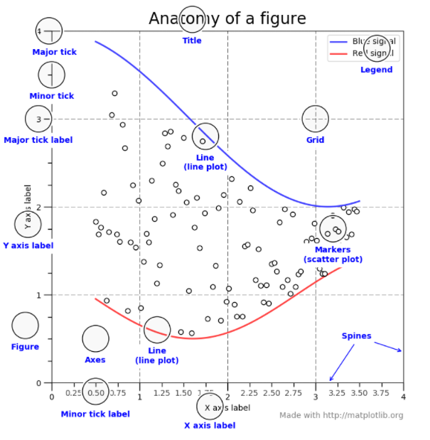
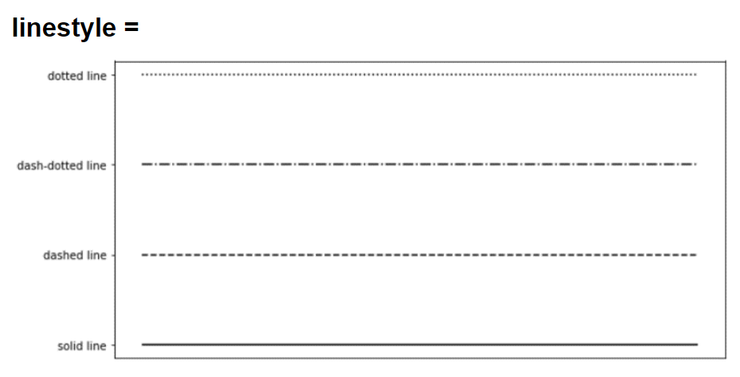
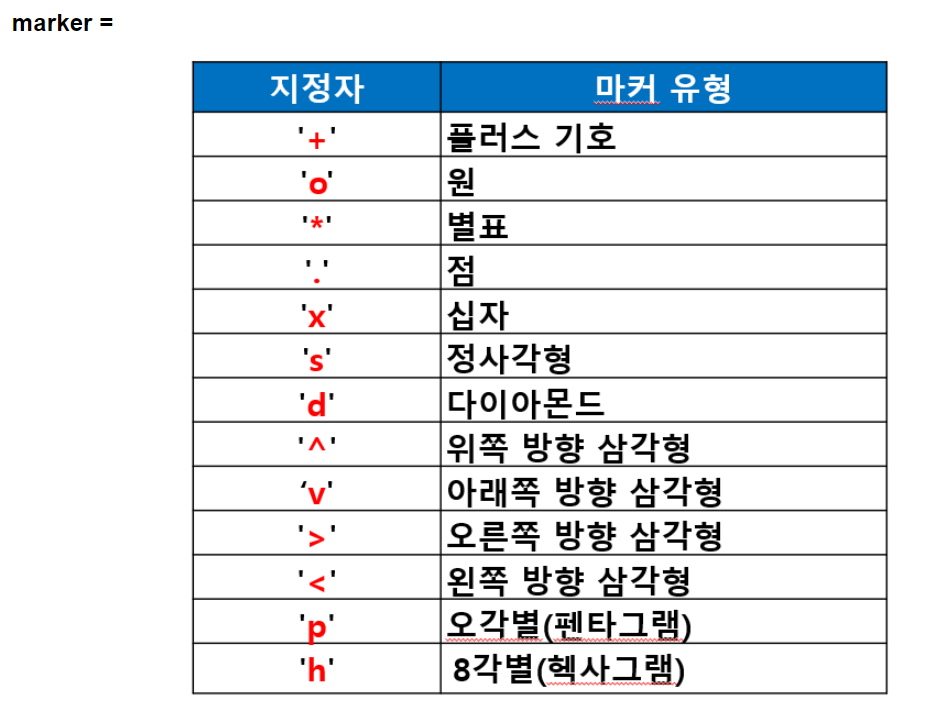
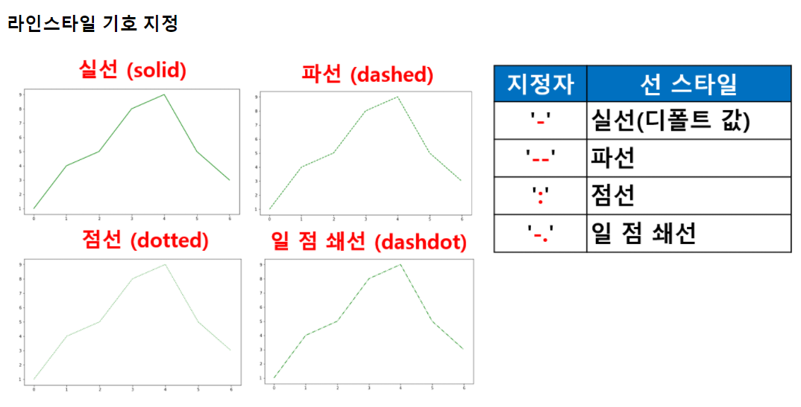

## matplotlib


- 시각화 패키지
- 파이썬 표준 시각화 도구로 불림
- 2D 평면 그래프에 관한 다양한 포맷과 기능 지원
- 데이터 분석 결과를 시각화 하는데 필요한 다양한 기능을 제공

#### 패키지 사용 법
1. matplotlib 주 패키지 사용시 

    - import matplotlib as mpl

2. pylab 서브 패키지 사용시 : 주로 사용 한다.

    - import matplotlib.pyplot as plt (주로 사용법)

- 매직 명령어 %matplotlib inline 
    - 주피터 노트북 사용시 노트북 내부에 그림을 표시하도록 지정하는 명령어
    - 추가적인 창에 그래프가 나오는 것이 아니라 노트북 내의 셀에 그래프가 나타남
- 지원 되는 플롯 유형
    - 라인플롯(line plot) : plot()
    - 바 차트(bar chart) : bar()
    - 스캐터플롯(scatter plot) : scatter() 
    - 히스토그램(histogram) : hist()
    - 박스플롯(box plot) : boxplot()
    - 파이 차트(pie chart) : pie()
    - 기타 다양한 유형의 차트/플롯을 지원 : 관련 홈페이지를 참고

---


## 한글지원 기능

```python
# 한글 문제
# matplotlit의 기본 폰트에서 한글 지원되지 않기 때문에
# matplotlib의 폰트 변경 필요
import platform

from matplotlib import font_manager, rc
plt.rcParams['axes.unicode_minus'] = False

if platform.system() == 'Darwin':  # 맥OS 
    rc('font', family='AppleGothic')
elif platform.system() == 'Windows':  # 윈도우
    path = "c:/Windows/Fonts/malgun.ttf"
    font_name = font_manager.FontProperties(fname=path).get_name()
    rc('font', family=font_name)
else:
    print('Unknown system...  sorry~~~')

```

---


## 함수설명 : plot()

- 기본으로 선을 그리는 함수
- 데이터가 시간, 순서 등에 따라 변화를 보여주기 위해 사용


- show()
    - 각화명령(그래프 그리는 함수) 후 실제로 차트로 렌더링 하고 마우스 이벤트등의 지시를 기다리는 함수
    - 주피터 노트북 에서는 셀 단위로 플롯 명령을 자동으로 렌더링  주므로 show 명령이 필요 없지만
    - 일반 파이썬 인터프리터(파이참)로 가동되는 경우를 대비해서 항상 마지막에 실행하도록 한다
    .


- 관련 함수 및 속성    
    - figure(x,y) : 그래프 크기 설정 : 단위 인치
    - title() : 제목 출력
    - xlim : x 축 범위
    - ylim : y 축 범위
    - xticks():yticks() : 축과 값을 잇는 실선    
    - legend() : 범례
    - xlabel() : x축라벨(값)
    - ylabel() : y축라벨(값)
    - grid() : 그래프 배경으로 grid 사용 결정 함수
    
- line plot 에서 자주 사용되는 스타일 속성(약자로도 표기 가능)
   *  color:c(선색깔)
   *  linewidth : lw(선 굵기)
   *  linestyle: ls(선스타일)
   *  marker:마커 종류
   *  markersize : ms(마커크기)
   *  markeredgecolor:mec(마커선색깔)
   *  markeredgewidth:mew(마커선굵기)
   *  markerfacecolor:mfc(마커내부색깔)

---


## 그래프 정리



---


## 주요기능

- marker : 마커의 종류
- markersize(ms) : 마커의 크기
- markeredgecolor(mec) : 마커 선 색깔
- markeredgewidth(mew) : 마커 선 굵기
- markerfacecolor(mfc) : 마커 내부 색깔








